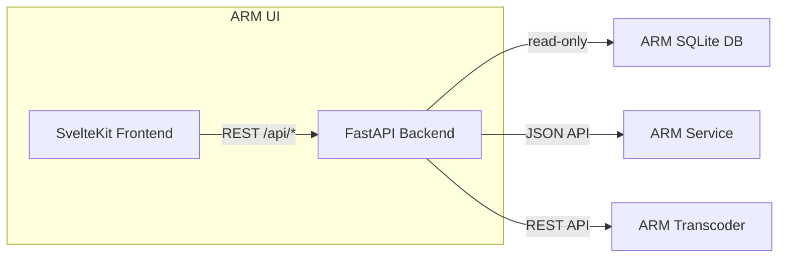

[](https://codecov.io/gh/uprightbass360/automatic-ripping-machine-ui)

# ARM UI

Part of the [Automatic Ripping Machine ecosystem](#related-projects). A modern replacement dashboard for the original ARM Flask/Jinja2 web interface.

Built with SvelteKit 2 and FastAPI, providing a unified view of ARM ripping jobs and GPU transcoding status in a responsive, dark-mode interface.

## Related Projects

This UI is part of a suite of projects that extend and improve the Automatic Ripping Machine:

| Project | Description |
|---------|-------------|
| [automatic-ripping-machine-neu](https://github.com/uprightbass360/automatic-ripping-machine-neu) | Fork of the original ARM with bug fixes and improvements |
| **automatic-ripping-machine-ui** | Modern replacement dashboard (this project) |
| [automatic-ripping-machine-transcoder](https://github.com/uprightbass360/automatic-ripping-machine-transcoder) | GPU-accelerated transcoding service |

The original upstream project: [automatic-ripping-machine/automatic-ripping-machine](https://github.com/automatic-ripping-machine/automatic-ripping-machine)

## Architecture



The backend reads ARM's SQLite database directly (read-only) for job data, calls ARM's JSON API for actions (abandon, delete, fix permissions), and talks to the transcoder's REST API for transcode job monitoring.

## Features

- Real-time dashboard with active rip and transcode job status
- Job management: view, abandon, delete, fix permissions
- Transcoder integration: job listing, retry, stats
- Log viewer with per-job log access
- Drive status monitoring
- Notification history
- Settings overview
- Dark mode with responsive layout

## Tech Stack

**Frontend:** SvelteKit 2, Svelte 5, TypeScript, Tailwind CSS 3, Vite 6

**Backend:** FastAPI, SQLAlchemy 2 (read-only), httpx, Pydantic Settings, Uvicorn

## Docker Images

Pre-built multi-platform images (`amd64`, `arm64`) are published to Docker Hub on every release:

```bash
docker pull uprightbass360/arm-ui:latest
```

For the full ecosystem quick start (ARM + UI + Transcoder), see the [ARM-neu README](https://github.com/uprightbass360/automatic-ripping-machine-neu#quick-start).

## Standalone Quick Start

If running the UI separately (outside the ARM-neu docker-compose):

```bash
git clone https://github.com/uprightbass360/automatic-ripping-machine-ui.git
cd automatic-ripping-machine-ui
cp .env.example .env
```

Edit `.env` with your ARM database path and service URLs:

```bash
ARM_UI_ARM_DB_PATH=/home/arm/db/arm.db
ARM_UI_ARM_LOG_PATH=/home/arm/logs
ARM_UI_ARM_URL=http://ARM_IP:8080
ARM_UI_TRANSCODER_URL=http://TRANSCODER_IP:5000
```

Start with Docker:

```bash
docker compose up -d
```

The UI is available at `http://localhost:8888`.

## Configuration

| Variable | Default | Description |
|----------|---------|-------------|
| `ARM_UI_ARM_DB_PATH` | `/home/arm/db/arm.db` | Path to ARM's SQLite database (read-only) |
| `ARM_UI_ARM_LOG_PATH` | `/home/arm/logs` | Path to ARM's log directory |
| `ARM_UI_ARM_CONFIG_PATH` | *(empty)* | Path to ARM's `arm.yaml` config file |
| `ARM_UI_ARM_HB_PRESETS_PATH` | *(empty)* | Path to HandBrake presets JSON file |
| `ARM_UI_ARM_URL` | `http://localhost:8080` | ARM web UI base URL (for job actions) |
| `ARM_UI_TRANSCODER_URL` | `http://localhost:5000` | Transcoder API base URL |
| `ARM_UI_TRANSCODER_API_KEY` | *(empty)* | Optional transcoder API key |
| `ARM_UI_PORT` | `8888` | Server port |

## Directory Structure

```
automatic-ripping-machine-ui/
├── docker-compose.yml
├── Dockerfile
├── requirements.txt          # Python backend dependencies
├── .env.example              # Environment template
├── backend/
│   ├── main.py               # FastAPI app, SPA serving, CORS
│   ├── config.py             # Pydantic settings
│   ├── dependencies.py       # Shared dependencies
│   ├── models/
│   │   ├── arm.py            # SQLAlchemy models (ARM database)
│   │   └── schemas.py        # Pydantic response schemas
│   ├── routers/
│   │   ├── arm_actions.py    # ARM job actions (abandon, delete, fixperms)
│   │   ├── dashboard.py      # Dashboard summary endpoint
│   │   ├── drives.py         # Drive status
│   │   ├── jobs.py           # Job listing and detail
│   │   ├── logs.py           # Log file viewer
│   │   ├── notifications.py  # Notification history
│   │   ├── settings.py       # Settings overview
│   │   └── transcoder.py     # Transcoder proxy endpoints
│   └── services/
│       ├── arm_client.py     # HTTP client for ARM JSON API
│       ├── arm_db.py         # Read-only ARM database queries
│       ├── log_reader.py     # Log file access
│       └── transcoder_client.py  # HTTP client for transcoder API
└── frontend/
    ├── package.json
    ├── svelte.config.js
    ├── tailwind.config.js
    ├── vite.config.ts
    └── src/
        ├── app.html
        ├── app.css
        ├── lib/
        │   ├── api/          # API client modules
        │   ├── components/   # Svelte components
        │   ├── stores/       # Polling and theme stores
        │   ├── types/        # TypeScript type definitions
        │   └── utils/        # Formatting and helpers
        └── routes/           # SvelteKit pages
```

## License

MIT License
